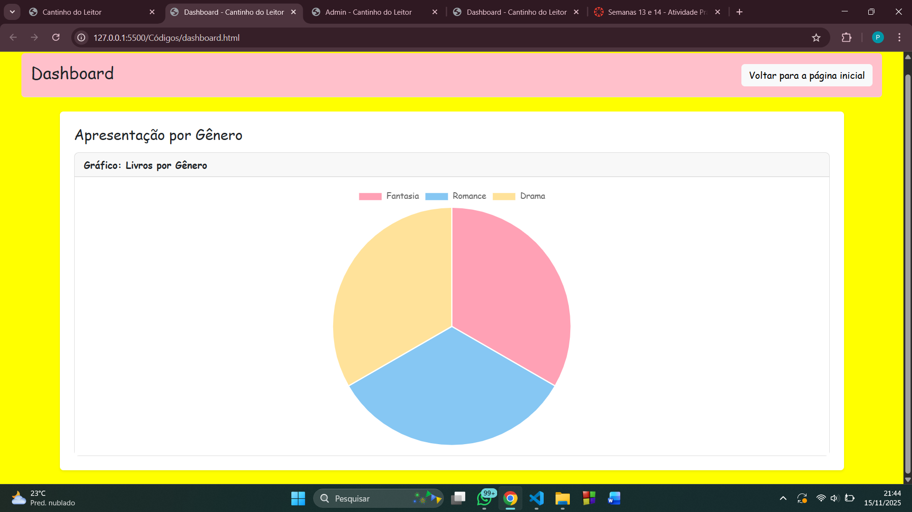

# Trabalho Prático 07 - Semanas 13 e 14

A partir dos dados cadastrados na etapa anterior, vamos trabalhar formas de apresentação que representem de forma clara e interativa as informações do seu projeto. Você poderá usar gráficos (barra, linha, pizza), mapas, calendários ou outras formas de visualização. Seu desafio é entregar uma página Web que organize, processe e exiba os dados de forma compreensível e esteticamente agradável.

Com base nos tipos de projetos escohidos, você deve propor **visualizações que estimulem a interpretação, agrupamento e exibição criativa dos dados**, trabalhando tanto a lógica quanto o design da aplicação.

Sugerimos o uso das seguintes ferramentas acessíveis: [FullCalendar](https://fullcalendar.io/), [Chart.js](https://www.chartjs.org/), [Mapbox](https://docs.mapbox.com/api/), para citar algumas.

## Informações do trabalho

- Nome: Perciliana Rodrigues
- Matricula: 904963
- Proposta de projeto escolhida: Pessoas e Produções
- Breve descrição sobre seu projeto: Esse projeto "Cantinho do Leitor" foi criado com objetivo de ter uma comunidade que conecta pessoas apaixonadas por leitura, e também, trazendo a história de cada autor e suas obras, e notícias de lançamentos em primeira mão.

**Print da tela com a implementação**

<< Foi usado o Chart.js para fazer um dashboard de gênero literário, apresentando atarvés de um gráfico de pizza os gêneros cadastros no site, e também, tem a opção de cadastrar novos livros, a medida que vai adicionando mais livros, mais vai atualizando o dashboard conforme o gênero cadastrado. >>

<<   >>

<<  >>
